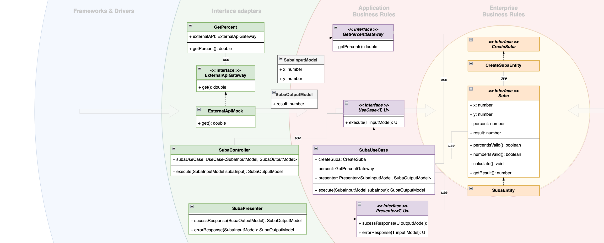
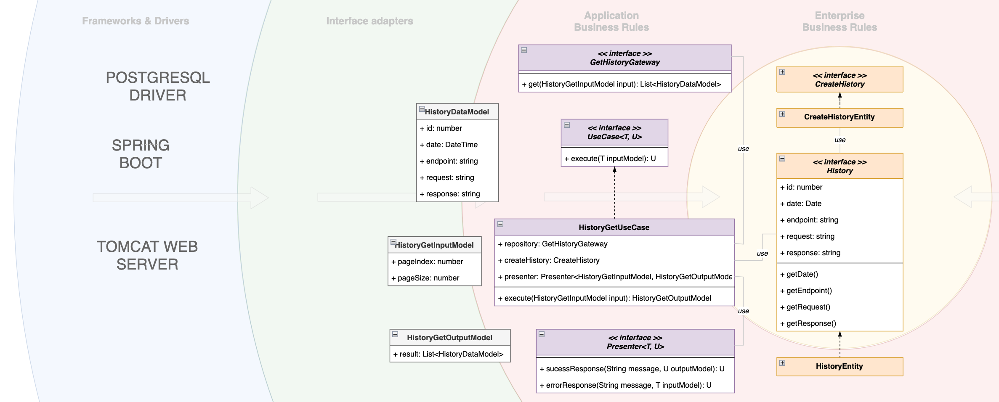

# ms-tempo-challenge

Para el desarrollo del desafío, se utiliza los principios de [The Clean Architecture](https://blog.cleancoder.com/uncle-bob/2012/08/13/the-clean-architecture.html) considerando:

### Principios
SOLID,
DRY,
SAP

### Design Patterns
Factory Method,

# Casos de uso

Se ha separado el desarrollo en distintos casos de uso:

## SubaUseCase

Aplica un incremento de X% sobre la suma de 2 números

### Use Case Schema

## HistoryUseCase

Historial de todos los llamados a todos los endpoint junto con la respuesta en caso de haber sido exitoso. El caso de uso tiene dos partes: la primera es la encargada de guardar los datos del historial en la base de datos y la segunda de obtener los datos paginados

### Use Case Schema

a. Guardar historial

b. Obtener historial

# requirements
Debes desarrollar una API REST en Spring Boot utilizando java 11 o superior, con las siguientes funcionalidades:

a. Sign up usuarios.

b. Login usuarios.

c. Debe contener un servicio llamado por api-rest que reciba 2 números, los sume, y le aplique una suba de un porcentaje que debe ser adquirido de un servicio externo (por ejemplo, si el servicio recibe 5 y 5 como valores, y el porcentaje devuelto por el servicio externo es 10, entonces (5 + 5) + 10% = 11). Se deben tener en cuenta las siguientes consideraciones:

El servicio externo puede ser un mock, tiene que devolver el % sumado. Dado que ese % varía poco, debe ser consumido cada media hora. Si el servicio externo falla, se debe devolver el último valor retornado. Si no hay valor, debe retornar un error la api. Si el servicio externo falla, se puede reintentar hasta 3 veces.

d. Historial de todos los llamados a todos los endpoint junto con la respuesta en caso de haber sido exitoso. Responder en Json, con data paginada. El guardado del historial de llamadas no debe sumar tiempo al servicio invocado.

e. El historial y la información de los usuarios se debe almacenar en una database PostgreSQL.

f. Incluir errores http. Mensajes y descripciones para la serie 4XX.

2. Se deben incluir tests unitarios.

3. Esta API debe ser desplegada en un docker container. Este docker puede estar en un dockerhub público. La base de datos también debe correr en un contenedor docker. Recomendación usar docker compose

4. Debes agregar un Postman Collection o Swagger para que probemos tu API

5. Tu código debe estar disponible en un repositorio público, junto con las instrucciones de cómo desplegar el servicio y cómo utilizarlo.
