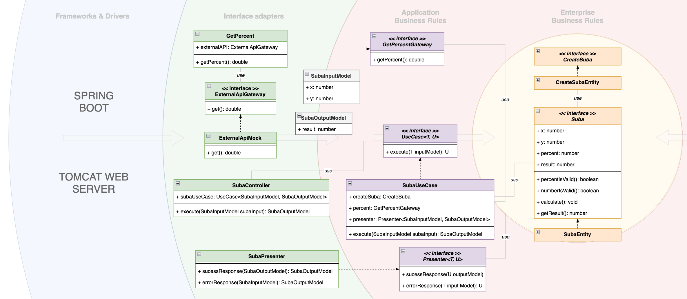
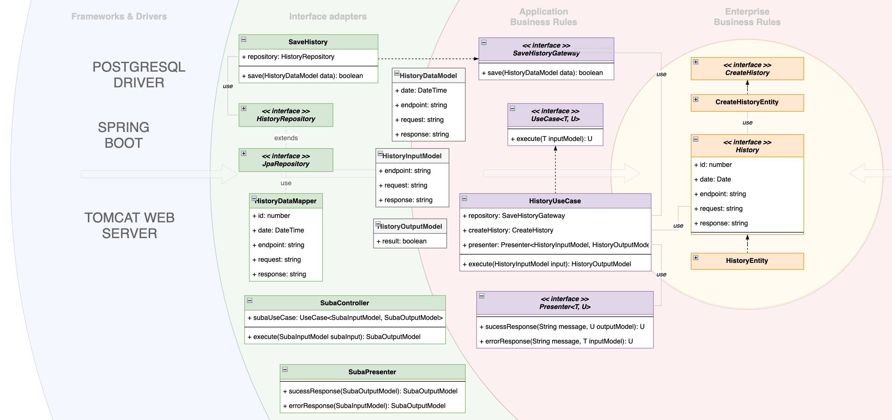
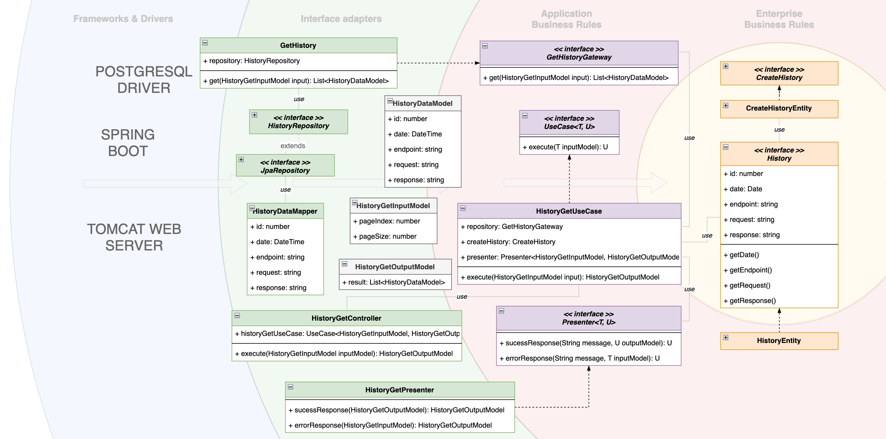

# ms-tempo-challenge

Para el desarrollo del desafío, se utiliza los principios de [The Clean Architecture](https://blog.cleancoder.com/uncle-bob/2012/08/13/the-clean-architecture.html) aplicado a 3 casos de uso.

Se intenta desacoplar en capas de tal manera de "proteger" las reglas de negocio de los detalles de la infraestructura utilizando inversión de dependencias y sin anotaciones de SpringBoot para desacoplar, por ejemplo, el DI framework

Se presentan esquemas de cómo se han desarrollado los casos de uso, desde las reglas de negocio hasta la implementación de las interfaces utilizadas (ver imágenes docs/images *-001.png a *-003.png o el historial de Github)

### Principios
SOLID,
DRY,
SAP

# Casos de uso

Se ha separado el desarrollo en distintos casos de uso:

## SubaUseCase

Aplica un incremento de X% sobre la suma de 2 números

### Use Case Schema



## HistoryUseCase

Historial de todos los llamados a todos los endpoint junto con la respuesta en caso de haber sido exitoso. El caso de uso tiene dos partes: la primera es la encargada de guardar los datos del historial en la base de datos y la segunda de obtener los datos paginados

### Use Case Schema

a. Guardar historial


b. Obtener historial


# Instalación


# Build

Clonar el repositorio 
```
git clone https://github.com/faq2035/ms-tempo-challenge.git
```

Compilar los fuentes
```
./mvn clean package
```

Generar la imagen docker (con springboot)
```
mvn spring-boot:build-image
```

Ejecutar la aplicación con docker-compose
```
docker compose up
```

La aplicación se levanta en el puerto 8080. Puede ser consumida por el [Postman](/challenge.postman_collection.json) adjunto

